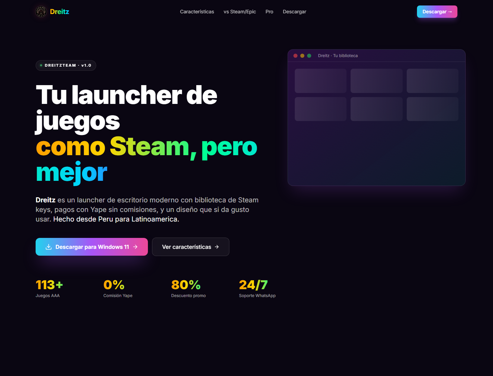

# Dreitzteam



[](#descarga)
[](#apps)
[](#stack)
[](#web-en-vercel)
[](#auto-update)

Dreitzteam es una suite de escritorio y web para una tienda de juegos digital:
un launcher estilo Steam, un panel admin para licencias y una landing lista para Vercel.

## Apps

| Producto | Ruta | Para que sirve |
| --- | --- | --- |
| Dreitz | `Dreitz/Programa/` | Launcher de tienda, biblioteca, carrito, pagos, alertas y actualizaciones. |
| Dreitz Keys | `Keys/Programa/` | Panel admin para catalogo, licencias, ventas, pagos e InsForge. |
| Web | `Dreitz/Programa/website/` | Source Vite de la landing publica. |
| Web estatica | `Dreitz/Website/` | Build listo para subir a Vercel o servir como static site. |

## Lo Principal

| Area | Detalle |
| --- | --- |
| Launcher | Tienda, biblioteca, wishlist, carrito, perfiles, Pro, misiones y bandeja del sistema. |
| Instalador | NSIS asistido con opcion para instalar solo para el usuario actual o para todos los usuarios. |
| Ajustes | Ventana separada estilo Steam, con tema, accesibilidad, idioma y moneda sincronizados en vivo. |
| Alertas | Campana con actividad, wishlist, misiones y updates desde GitHub Releases. |
| Admin | Dreitz Keys administra catalogo, licencias, Yape, PayPal, Culqi, InsForge y auditoria. |
| Web | Landing con CTA de descarga, comparativa y assets optimizados. |

## Descarga

La app se distribuye desde GitHub Releases:

```text
https://github.com/Dreftian/Dreitzteam/releases/latest
```

Los instaladores se generan en:

```powershell
Dreitz\Programa\dist\Dreitz-Setup-1.0.2.exe
Keys\Programa\dist\Dreitz Keys-Setup-1.0.2.exe
```

## Desarrollo

```powershell
# Dreitz launcher
cd Dreitz\Programa
npm install
npm run dev

# Dreitz Keys
cd ..\..\Keys\Programa
npm install
npm run dev

# Landing web
cd ..\..\Dreitz\Programa
npm run dev:website
```

## Build

```powershell
# Launcher
cd Dreitz\Programa
npm run build:win

# Keys
cd ..\..\Keys\Programa
npm run build:win

# Web estatica para Vercel
cd ..\..\Dreitz\Programa
npm run build:website
```

## Web En Vercel

Este repo incluye un `vercel.json` en la raiz. Al importar `Dreftian/Dreitzteam`
en Vercel, el build queda configurado asi:

| Campo | Valor |
| --- | --- |
| Install Command | `cd Dreitz/Programa/website && npm ci` |
| Build Command | `cd Dreitz/Programa/website && npm run build` |
| Output Directory | `Dreitz/Website` |

La landing usa assets cacheados, headers de seguridad y enlaces directos al release
mas reciente del launcher.

## Auto Update

Dreitz usa `electron-updater` con GitHub Releases:

```yaml
publish:
  - provider: github
    owner: Dreftian
    repo: Dreitzteam
    releaseType: release
```

Cuando hay un release nuevo con `latest.yml`, el launcher muestra una alerta en la
campana de notificaciones y permite actualizar/reiniciar desde la app.

## Stack

| Capa | Tecnologia |
| --- | --- |
| Desktop | Electron, electron-vite, electron-builder, NSIS |
| UI | React, Tailwind, Framer Motion, lucide-react |
| Datos locales | better-sqlite3 |
| Updates | electron-updater + GitHub Releases |
| Web | Vite, React, Vercel |
| Backend remoto | InsForge |

## Release Manual

```powershell
cd Dreitz\Programa
npm run build:win
cd ..\..\Keys\Programa
npm run build:win
cd ..\..\Dreitz\Programa
npm run build:website
```

Despues se crea un release en GitHub con:

```text
Dreitz-Setup-1.0.2.exe
Dreitz-Setup-1.0.2.exe.blockmap
latest.yml
Dreitz.Keys-Setup-1.0.2.exe
Dreitz.Keys-Setup-1.0.2.exe.blockmap
```

## Licencia

Uso personal de Dreitzteam. No redistribuir sin permiso.
